# Claudio Band: a producer jamming with agent musicians

## Context

Claudio today is one Claude agent designing one FM patch through a closed measure loop. It has been ported to Convex on branch `convex-port`, and most of the port is uncommitted.

The new direction:
- **One human producer**, who is also **a member of the band**, directs **three Claude musicians**: drums, bass and keys.
- Each musician has its own instrument and step sequencer.
- Together they loop a section that never stops.
- The producer steers with notes in a band chat, and plays along live.

**Will's decisions**

| Area | Decision |
|---|---|
| Timing | Musicians submit whole patterns; changes land at the next **loop line** |
| Chat | One band chat with @mentions; each musician keeps its own Claude context |
| Library | Global. Starters plus every sound anyone designs. Per musician: pick one, design one (drop a WAV or describe it), or tweak it in chat |
| Drums | Sample kit (808 kick sample; the other voices synthesized) |
| Producer | Own strip and sound. Plays **live only**, on a QWERTY keyboard **locked to the key**. The agents don't hear the notes, but are told the producer is playing along |
| Models | Measured sound design on **Claude Opus 5.5**. Band turns, including quick sound tweaks, on **Claude Sonnet 5** |
| Agents | Server-side Convex functions (see §4). **Reactive nudges** within a budget |
| History | Walk back and forth through each strip's versions; Backspace undoes the band's actions |
| Sequencer | step, degree or voice, length, velocity, **accent**, **tie** |
| Scenes | A/B |
| Keys | A fast keystroke for everything |
| Testing | An end-to-end testing story that keeps the implementation on the rails |
| Delivery | Two waves |
| Branch | `feature/band`, off `convex-port`. The plan is checked in |

**Sound design is the gate.** A jam opens with a soundcheck: instruments get built before the first note. Pitch framing: *"the band builds its sounds, then you build a loop together and flip between two sections."*

**Headline** (the scripted demo; the keystrokes live in `docs/headline.md`):
1. **Soundcheck.**
   - Drop a WAV on keys *first*. The Opus 5.5 measure loop runs in keys' strip while you give drums the kit, pick bass from the library and choose your own sound.
   - Audition each strip on the keyboard.
   - Fallback if the design passes its cutoff: cancel, then pick "Glass EP (designed from electric_piano.wav)" from the library. The library is global and shows where each sound came from, so this is honest.
2. **`Space`: the jam starts.** The starter parts play, and you play along.
3. **"@bass busier, eighth notes".**
   - Bass's strip shows thinking, then "lands in N beats".
   - The change lands at the loop line while everything keeps playing, and bass's reply threads under your note.
   - The band reacts once: keys adjusts to the new bass (wave 2).
4. **"@keys make it glassier", then one more try that loses the thread.** The new sound swaps in at the loop line and appears in the library. `Esc` `4` `←` brings the good version back at the next loop line.
5. **Scenes.** Save A, reshape the band, save B, flip between them.

## Step 0: check the plan in (first action after approval)
1. Commit the uncommitted Convex port on `convex-port` as a checkpoint. HEAD doesn't build without it.
2. `git switch -c feature/band`.
3. Commit this plan as `docs/plans/claudio-band.md`, plus a one-line pointer in `PLAN.md`.
4. **Stop** for the design review below before any code.

## Step 1: design review gate (timeboxed at 1.5h, no code changes)

The producer's screen is the product, so it is designed and reviewed first.

- **Mockup:** one private HTML artifact with a **state switcher**, one frame per scenario (S1–S11, H). It includes:
  - **One animated strip:** playhead, thinking pill, "lands in N beats", a reply arriving in chat.
  - **Strip anatomy:** DOM step grid with a playhead column, history rail, status, countdown, and the soundcheck design rail with distances.
  - **Chat:** threading, and how nudge rows look.
  - **Keyboard dock**, and the `?` shortcut overlay.
  - **Starting layout**, including your own strip. It answers three open questions: strips across or down, design iterations inside the strip or in a side panel, chat in the right column or at the bottom.
- **Text checklist** instead of frames: the failure states, library drawer detail and direct controls.
- **Not included:** Tone.js audio.
- **Data-model artifact:** the ER diagram below, plus a table showing which UI element reads and writes each table (15 minutes).
- **Will reviews both.** Feedback goes into this plan, and into its checked-in copy, before slice 0.

```
┌ Claudio Band · 6ZQQ59Y8 ── SOUNDCHECK │ Space ▶ │ 96 bpm │ D minor │ i–VI–III–VII │ 3.2 │ [A] [B] │ reacts ● ┐
│ ┌ 1 you · Soft Pad ▾ ───── LIVE ─────────────────────────────────────────────────┐ │ BAND CHAT      │
│ ┌ 2 drums · Kit ─────────┐ ┌ 3 bass · Rubber Bass ▾ ─┐ ┌ 4 keys · Glass EP ▾ ──────┐ │ you → @bass:   │
│ │ kick X...x...X...x...  │ │ 0:0~ 2:0 4:4 6:0 (deg)  │ │ ▬▬▬▬▬▬▬▬    ▬▬▬▬▬▬▬▬       │ │  busier, 8ths  │
│ │ snr  ....x.......x...  │ │ lands in 3 beats        │ │ designing · iter 2/3      │ │ @bass ↳ eighths│
│ │ hat  ..x...x...x...x.  │ │ v1 v2 v3 [v4]  think…   │ │ d=18.4 → 11.2   v1 [v2]   │ │  on the root…  │
│ └────────────────────────┘ └─────────────────────────┘ └───────────────────────────┘ │ [@keys …    ⏎] │
│ ▕██████████░░░░░░░░░░░░░░░░░░░░░░░░░▏ loop 2                                        │                │
│ keys → you · D minor · oct 4 (Z/X) · top row +1 oct            B library · ? keys    │                │
└──────────────────────────────────────────────────────────────────────────────────────┴────────────────┘
```

## Approach

### 0. Git, the plan record, and data
- Checkpoint-commit the port on `convex-port` (HEAD doesn't build without the untracked files), then `git switch -c feature/band`.
- **First commit on `feature/band`: this plan, as `docs/plans/claudio-band.md`,** plus a one-line pointer in `PLAN.md`.
  - The copy has a **Change log** section at the bottom.
  - Any later decision that changes the plan, or changes a frozen test (see the testing story), updates the copy in the same commit.
- **Wipe the local Convex data at the start of slice 3,** after slice 2 has saved the starters to `src/shared/starters.ts`. Existing rows would fail the new validators.

### 1. Data model (`convex/schema.ts`)

**Rules the model obeys**
- **Part versions are append-only, and the newest one plays.** Agent turns, picks, history steps, scene recalls and undos all insert rows. There is no "current" pointer, because pointers make history steps after a scene recall ambiguous.
- **Arrows move along a strip's rail. Backspace undoes the band's actions.**
  - *Content versions* (source starter, agent, pick or design) get a pip on the rail, and their `basedOn` is their own version number. *Copies* (history, scene or undo) restate a content version's `basedOn`.
  - **`←`/`→`** move to the neighbouring pip in time order. Canonical example:
    - v1–v4, then `←` `←` goes to v2, `→` goes to v3, and a new prompt adds v5.
    - `←` from v5 then goes to v4, the pip to its left.
    - At either end, or a jump to the current version, nothing is written. `jumpTo` on a copy resolves to its `basedOn`.
    - This is the pure function `planHistory`.
  - **`Backspace`** (wave 2):
    - Each mutation stamps its rows with one `txn`, and each row records `prev`, the `basedOn` it replaced. A scene recall also records `prevMuted`.
    - Undo reverses the newest txn that is neither an undo nor already undone. It appends copies that restate `prev`, restores `prevMuted` for scene txns, and sets `undoes: txn`. Pressing it again keeps walking back, across musicians.
    - In the example above, Backspace from v5 goes to v3. There is no redo.
    - This is the pure function `planUndo`.
    - The `txn`, `prev` and `prevMuted` fields ship in wave 1, so wave 2 needs no migration.
  - **One commit writes one part version.** A multi-tool turn is merged into a single row.
  - **Mute is not history.** `muted` lives on `musicians`, and solo is client-only.
- **Each value with its own write rhythm gets its own document.** The counters live in `jamCounters`. `jams` changes only when the producer edits settings. `jams.state` still re-runs on every turn, because it reads musicians, parts and designs; that's fine at demo scale.
- **Each conversation has one log, one model and one fixed tool list.** Band turns run on Sonnet with band tools, and design jobs on Opus 5.5 with design tools. `messages.convoId` is `v.union(v.id("musicians"), v.id("designs"))`. It can be indexed, and `normalizeId` tells the two apart.
- **Library rows are immutable.** Part versions and scenes point at them.
- **There is no presence and no heartbeat.** Band turns fire only on producer notes, and reactions spend the budget each note grants. Design renders need the producer's browser. So an empty room can't loop and cost money.

```mermaid
erDiagram
  jams ||--|{ musicians : "3 agents + 1 human"
  jams ||--|| jamCounters : "hot counters"
  jams ||--o{ chat : "band chat"
  musicians ||--o{ parts : "versions; newest plays"
  musicians ||--o{ designs : "design jobs"
  musicians ||--o{ messages : "band log (convoId)"
  designs ||--o{ messages : "design log (convoId)"
  designs ||--o{ attempts : "measured proposals"
  library ||--o| designs : "library.designId"
  parts }o--o| library : "parts.libraryId (null = kit)"
  chat }o--o{ musicians : "to[] ids, reactor, chatCursor"

  jams { string slug  string producerClientId  string phase  bool reactive  number bpm  number keyPc  string scale  number bars  array progression  object scenes }
  jamCounters { id jamId  number chatSeq  number reactionBudget  number lastProducerSeq }
  musicians { id jamId  string kind  string role  string name  bool muted  number liveOctave  string status  string turnCause  number statusSince  number turnSeq  number turnDeadline  id turnJobId  number msgSeq  number chatCursor  id activeDesignId  string lastError }
  parts { id musicianId  id jamId  number version  number basedOn  number prev  bool prevMuted  string txn  string undoes  string source  string label  number lengthBars  array notes  id libraryId }
  designs { id musicianId  id jamId  string status  string origin  object target  string prompt  object renderSpec  number iteration  string pendingToolUseId  string pendingPresetId  string renderOwnerClientId  number renderLeaseUntil  number renderAttemptNo  number turnSeq  number turnDeadline  number msgSeq  number noToolStrikes  string lastError }
  messages { id convoId  number seq  string role  any content }
  attempts { id designId  string presetId  number iteration  object preset  string rationale  object features  number distance  bool isFinal }
  chat { id jamId  number seq  string kind  id fromMusicianId  array to  id reactor  number replyToSeq  string text }
  library { string name  string role  object preset  object features  string origin  string source  id designId  id fromJamId  string starterKey }
  fakeScripts { string match  number turnIndex  any response }
```



**Tables** (fields beyond the diagram, and why):
- **jams**
  - `phase` is soundcheck or jam. Transport play/stop is client-only.
  - `scenes: {A?, B?}` is `v.record(v.id("musicians"), v.object({basedOn, muted}))`. Recall is one txn and is refused while any design is running. Active scene = every part's **`basedOn`** and `muted` match, so a scene you just recalled reads as active.
  - Index: `by_slug`.
- **jamCounters:** `chatSeq` (every chat insert reads and writes it, so chat order is commit order and the cursor can't skip rows; `_creationTime` was rejected because it is assigned at insert, not commit), `reactionBudget`, `lastProducerSeq`.
- **musicians**
  - `kind` is agent or human. There are 4 per jam. The human row has role `producer`, name `you`, and `liveOctave` (reported in the snapshot). It uses parts (sound only, empty notes), designs, history and scenes, but it has no turn state, and `drainInbox`, nudges and `to[]` all skip it.
  - Band status is `idle` or `thinking`, fenced by `turnSeq`. `activeDesignId` holds the band inbox while it's set.
  - Indexes: `by_jam`, `by_status_deadline`.
- **parts**
  - `source`: starter, agent, pick, design, history, scene or undo.
  - `label`: the rail caption, from the agent's `say` or the pick name.
  - The next version is read newest-first from `by_musician_version`, plus one.
  - Indexes: `by_musician_version`, `by_jam` (newest first).
- **designs:** today's `sessions` row, re-keyed.
  - `status`: thinking, awaiting_render, done or failed.
  - `origin`: wav or prompt.
  - Indexes: `by_musician`, `by_status_deadline`, `by_render_lease`.
- **messages:** index `by_convo_seq`.
- **attempts:** indexes `by_design_iteration`, `by_design_preset`.
- **chat**
  - `kind`: producer, musician, system or nudge.
  - `to[]` holds musician **ids**; empty means every agent.
  - `reactor` is the one musician a nudge may trigger.
  - `replyToSeq` threads a reply under the note it answers.
  - Index: `by_jam_seq`.
- **library**
  - `role`: bass or keys. The producer picks from **any** pitched sound. Drums use only the kit, so the drums strip offers no pick or design, and drums get no `use_library_sound` tool.
  - `origin`: starter, designed or tweak.
  - `source`: the WAV filename, the prompt, or "tweak of X".
  - `features` is nullable. `starterKey` is used to upsert rows from `src/shared/starters.ts`.
  - Indexes: `by_role` (newest first), `by_starterKey`.
- **fakeScripts:** in the schema everywhere. Every read and write through `testing:*` is refused unless `CLAUDIO_FAKE_LLM=1`.
- **Deleted:**
  - presence and its modules, fork, claimRender and releaseOnLeave;
  - `main.ts`, `verify-loop.mjs`, `clearMessages`, `clearSessionContent`.
- **Rewritten:**
  - The render owner is `jam.producerClientId`.
  - `reassignOrAbandonRender` becomes "re-grant to the producer until `MAX_RENDER_ATTEMPTS`, then `endDesign("failed")`".

**Queries:**
- `jams.state(slug)`: the jam, musicians, each musician's newest part with its resolved preset, and active designs with their attempts;
- `parts.rail(musicianId)`: the content versions (`version`, `label`, `source`) for the history rail;
- `jams.chat(jamId)`;
- `library.list(role | "pitched")`.

### 2. Patterns (`src/shared/pattern.ts`, imports nothing; **built in slice 1**)

**Pitched notes:** `{step, deg, len, vel, accent, tie}`. `deg` is a **chord-relative scale degree**: the pitch is `degreeToMidi(key, scale, progression[bar] + deg, octave)`, and `deg 0/2/4` are always chord tones.
- **`accent`:** velocity +0.25, clamped to 1.
- **`tie`** (wave 2; until then `clampPattern` forces `false` and the tools don't expose it):
  - **bass** glides into the next hit;
  - **keys** merges into the next hit of the same degree, **within the bar only**. At a bar line where the resolved pitch changes, it re-attacks, so parts still follow the chords.
  - A tie on the last hit carries into the next repeat. Promotion, stop and mute release tied notes.

**Drum hits:** `{step, voice: kick|snare|hat|openhat, vel, accent}`. There is **at most one of hat or openhat per step**, because the two share one MetalSynth.

**Rules**
- `lengthBars` is 1, 2 or 4, and repeats.
- **`clampPattern()`** clamps and never rejects. It dedupes, caps notes per step (bass 1, keys 4) and in total. An empty pattern means "lay out".
- **`summarizePattern()`:** explicit step lists, with accents as `X` vs `x` and ties as `~`, e.g. `kick 0,4,8,12 · snare 4,12` and `0:0~ 4:4`.
- **Tool schemas** follow the `PRESET_JSON_SCHEMA` rules: strict, every field required, no min/max.

### 3. Client audio (`src/client/audio/`)

**Model:** a musician's step sequencer is **data**, its newest part row. **One clock and one tick** drive every track, so tracks can't drift and every change promotes on the same step. Agents write parts and never trigger notes.

**`sequencer.ts`**, the musical logic (new; pure, no Tone import, unit-tested in Node):

`schedulerStep(state, g) → {state', promotions, events}` carries state across steps:
- **Per track:** `current`, `staged`, `landsAtG`, and `sounding` (which tied midi is held).
- **Per jam:** `lastG`, and the loop origin `g0`.

On each step:
- `s = (g − g0) % loopSteps`, and `bar = floor(s/16)`.
- **Promotion** happens only when `g >= landsAtG`. `landsAtG` is set at stage time to `(floor(lastG/loopSteps)+1)*loopSteps`, relative to `g0`. That makes the countdown and the actual landing the same number.
- A promotion also releases any held notes and applies staged tempo, key, progression or bar-count changes. A bar-count change resets `g0`.
- **Pitch** resolves per bar, so a 1-bar part follows the chords.
- The sequencer **ignores mute**; the channel does the muting, so a tied note is released even while muted.

Event types:
- `attack {track, midi, durTicks | null, vel}` (`null` means tied);
- `glide {track, midi}`;
- `release {track, midi}`;
- `hit {track, voice, vel}`.

Accent is folded into `vel`.

**Threading and ownership: why tracks can't skew**
- **One owner.** The engine is the single owner of all sequence and instrument state. Everything else talks to it by message: `engine.stage()` only *enqueues* into a mailbox. The tick drains the mailbox at the start of each step, then runs `schedulerStep` on a consistent state, so a Convex update can never land in the middle of a tick.
- **Timing lives off the main thread.** The Transport's wake-up clock runs in a Web Worker (Tone's default `clockSource: "worker"`). Every note is scheduled ~150ms ahead at an exact time and played sample-accurately by Web Audio's rendering thread.
- **Tracks can't skew.** All tracks are scheduled in the same tick at the same `time`. A main-thread stall longer than the lookahead makes the notes in that window late or dropped together, never out of step with each other. `missedSteps` measures it.
- **Why the engine isn't its own thread:** Tone nodes can't run in a Worker or AudioWorklet. A worker-hosted sequencer would still need the main thread to trigger notes. A true off-thread engine means rewriting the FM synths as custom AudioWorklet DSP, which is out of scope. **Escalation path, if the stress test fails:** raise the lookahead first, then consider the AudioWorklet rewrite.
- **Main-thread discipline:**
  - the tick does no DOM work (only `draw.schedule`);
  - the grid and rail redraw only on change;
  - instruments are built in `stage()`, not the tick;
  - reconcile diffs by `basedOn` and `libraryId`.

**`engine.ts`**, the Tone layer (new):
- **One live context.** It captures `liveCtx = Tone.getContext()` once and uses `liveCtx.transport`, `liveCtx.draw` and `liveCtx.immediate()`. Every live node is built with `context: liveCtx`. So a `Tone.Offline` render can never capture a live instrument, even inside its one microtask of global swap.
  - `getAudioContext()` returns `liveCtx.rawContext`, so there is one AudioContext and the target preview goes through the master bus.
- **Clock:** `liveCtx.lookAhead = 0.15`; one `transport.scheduleRepeat(tick, "16n")`; `g = Math.round(getTicksAtTime(time)/(PPQ/4))`.
- **Tick body:**
  - wrapped in try/catch, so a bad event costs one note and never a batch of steps;
  - updates `__band.g`, and counts `missedSteps` when `time < rawContext.currentTime`;
  - at a boundary with a tempo change, calls `bpm.setValueAtTime` **before** converting any durations;
  - maps each event:

    | Event | Engine call |
    |---|---|
    | `attack` | `triggerAttackRelease(hz, \`${durTicks}i\`, time, vel)`, a tick string so it follows tempo; `{ticks: n}` is not valid Tone time and throws. A tied attack is `triggerAttack` |
    | `glide` | `bass.frequency.exponentialRampTo(hz, glideSec, time)` (bass `portamento` stays 0, otherwise notes glide by accident) |
    | `release` | `triggerRelease(midi, time)` for poly, `triggerRelease(time)` for the mono bass |
    | `hit` | `kit.hit(voice, time, vel)` |
  - DOM playhead updates go through `liveCtx.draw.schedule`; all test state is updated in the tick itself.
- **Stop:** releases every sounding note and resets the sequencer state.
- **`engine.stage(track, part)`** runs from `reconcile`, off the audio path. It keys on content: it restages only when `basedOn` changes, and swaps the instrument only when `libraryId` changes. It builds the new instrument there and **pre-warms its voices**.
- **Old instruments** get `releaseAll(time)` (poly) or `triggerRelease(time)` (mono) at promotion. They are disposed after `max release + 0.5s`.
- **Injectable instruments:** a spy implementation records every call, so E2E can check what the engine played, not only what the sequencer asked for.

**Instruments**
- **Graph:** instrument → `Channel` → master → `Limiter(-2)` → `Meter`.
- **Bass:** a monophonic `FMSynth` (from `presetToOptions`, 4-operator nesting intact).
- **Keys:** `PolySynth(FMSynth)` with **maxPolyphony 24**. **You:** 16 voices. Band keys releases are capped at 1.5s. PolySynth *drops* notes, it does not steal voices.
- **Kit (`kit.ts`):**
  - kick through `Tone.Sampler` or a one-shot buffer source, so velocity and accent reach it;
  - snare: `NoiseSynth` + `MembraneSynth`; hat and openhat: one `MetalSynth` with short and long decays;
  - `hit()` forces `t = max(time, last[voice] + 1e-3)` and uses try/catch. Tone throws on equal start times, which late steps can produce.
- **Your live part:**
  - The key router triggers your channel with **`liveCtx.immediate()`** for both attack and release. Plain `now()` includes the lookahead, which would make you 150ms late.
  - Keys map to scale degrees in the key through `degreeToMidi`.
  - A held-key → synth map ensures a key released after a sound swap releases on the synth that started it.
  - In soundcheck, the keyboard plays the armed strip; in the jam, always your strip.
- **Design renders:** unchanged `renderPreset` / `Tone.Offline`. They are safe during playback because every live node is pinned to `liveCtx`.

### 4. Turns: Convex server functions

Each Convex function type has one job here:
- the Claude call is an **`internalAction`** (`convex/llm.ts`);
- saving a result is a fenced **`internalMutation`**;
- turns are started with **`ctx.scheduler.runAfter`**, atomically with the mutation that starts them, so musicians think in parallel;
- the watchdogs are **`cronJobs`**;
- the browser subscribes to **reactive queries**;
- the producer's actions are **public mutations**.

**Direct producer mutations (no LLM)**
- **Library pick**, **mute**.
- **Scene save and recall.** Recall is refused while any design is running.
- **bpm, key, progression, bars; "band reacts".**
- **History:** `parts.step(m, back|forward)`, `parts.jumpTo(m, v)`, and in wave 2 `parts.undo(jamId)`. Refused for a musician that is designing; undo is refused while any design is running.
  - Stepping, jumping, picking or undoing on a **thinking** musician cancels its turn first: wave 1 bumps `turnSeq` only; wave 2 uses `cancelTurn`. Your rollback always wins.
- **`designs.start({musicianId, wav | prompt})`** is the only way to start a design.
- **`jams.start`** switches phase to jam. It is refused while any design is running.

**`postChat(ctx, row)`** is the only chat writer. It takes the seq from `jamCounters`, inserts the row, then calls `drainInbox(t)` for each target.

**`chat.send`**
- Parses `@name`, `@role` and `@all` into ids.
- Sets `lastProducerSeq`.
- Sets the budget: **1** for a note to one musician, **0** for `@all` or several.
- Calls `postChat`.

**`drainInbox(m)`**, one rule. `planDrain` is a pure function.
1. **Return** if the musician is thinking or `activeDesignId` is set. Held notes show as "queued until the sound is done".
2. **`relevant`:** rows after `chatCursor` addressed to m or to every agent, excluding m's own rows. It loops through batches.
3. **`trigger`:** a producer row, **or** a nudge where `reactor === m`, its seq > `lastProducerSeq`, the budget is above 0 and `jams.reactive` is on. System rows and other nudges are context only.
4. **If there is a trigger:**
   - append one user turn: healBlocks, then the snapshot, then every relevant row;
   - set the cursor to the last scanned row;
   - set `turnCause`: producer if any producer row is present, otherwise nudge, spending one unit;
   - call `beginTurn`. All of this happens in one mutation.
5. **Otherwise:** leave the cursor just before the first unread nudge or system row.

It also runs after every commit, fail, cancel and watchdog branch, and after `endDesign`.

**Band turns**
- **Request:** `claude-sonnet-5`, low effort, `tool_choice: {type:"any"}`, strict tools, **no `disable_parallel_tool_use`**. Lease and timeout come from `llm.ts` for each turn kind: band is 45s lease with a 30s timeout.
- **Tools (a fixed list per role; every tool has a `say`):**
  - `set_pattern` or `set_drum_pattern`;
  - `set_sound` (bass and keys; inserts a `tweak` library row);
  - `use_library_sound` (bass and keys);
  - `just_reply`;
  - `stay`.
- **`commit`**, in order:
  1. If `stop_reason` is refusal or max_tokens, save nothing, apply nothing, append "[the previous request failed; ignore it]", and `fail`.
  2. Otherwise save the assistant turn exactly as returned.
  3. Validate every call and never throw; an invalid call becomes an `is_error` result.
  4. **Merge all valid changes into one part row.** Its label joins the `say` values.
  5. Append one user message containing exactly one tool_result per `tool_use` id, in order.
  6. Post each `say` as a musician row threaded under the note it answers.
  7. Wave 2: if the pattern changed, post one nudge row addressed to every agent, with `reactor` taken from a fixed map (bass → keys, drums → bass, keys → bass).
  8. Set the musician idle, then drain.
- **Band watchdog** (wave 1): sweeps `musicians.by_status_deadline`. A stuck turn is failed with the same ignore note, then drained.
- **`cancelTurn(m)`** (wave 2): bumps `turnSeq`, appends "[producer cancelled the request above; ignore it]", sets idle, drains. A cancel that arrives after the commit does nothing and suggests Backspace.
- **`loadMessages` merges adjacent same-role rows** the same way on every call. The Anthropic docs contradict each other on whether consecutive user messages are allowed; merging makes the question moot. No stored history is edited.

**Reactive nudges** (wave 2)
- **Budget:** 1 for a note to one musician, 0 for `@all`, several targets or scenes. Only the named `reactor` can trigger, and only on nudges newer than the last producer note.
- **Toggle:** "band reacts" (`\`) turns nudges off.
- **Staying put:** `stay` adds no version, so it never sets off another nudge. The prompt says to prefer staying unless the change clashes.
- **Display:** nudge rows render as dim one-liners, the strip shows "reacting to @bass", and the reply threads under the producer note that started the chain.

**Design jobs** (the existing loop, re-keyed to designs, on `claude-opus-5-5`)
- **Request changes in `llm.ts`:**
  - `tool_choice: auto` (`any` returns a 400 on 5.5), with `disable_parallel_tool_use` and strict `propose_preset`/`finalize`;
  - the system rule "every design turn must call `propose_preset` or `finalize`";
  - effort set explicitly: `medium` on the first proposal, then `low` (one cache miss, accepted);
  - adaptive thinking;
  - the log stays append-only and exactly as returned;
  - `DESIGN_MODEL` falls back to `claude-opus-5`, keeping the old `any` branch in `llm.ts` for that case.
- **Guards:**
  - refusal or max_tokens saves nothing, then `endDesign("failed")` (a `reasoning_extraction` refusal is not retried);
  - **no-tool guard:** save the turn as returned, append "Call propose_preset or finalize now", and increment `noToolStrikes`. On the second strike, `endDesign("failed")`.
- **`endDesign(ctx, design, outcome)`** is called from every terminal branch: finalize, fail, the stop reasons, the second strike, `abandonRender`, and the design watchdog. It:
  - sets the design's status;
  - clears `activeDesignId`;
  - on finalize, inserts a `designed` library row and appends a `design` part version;
  - posts a system row addressed to the musician ("your sound is now X", or the reason it failed);
  - drains.
- **Render owner** is the producer. `submitAnalysis` and `submitRenderError` take a `designId`. Notes are held until the design ends, never folded in.

**Jam creation:** upsert starters by `starterKey`. Create **4** musicians: three agents with v1 starter parts, and you with a v1 sound part. Phase is soundcheck. **No automatic first turn.**

### 5. Prompting (`convex/prompts/`)
- **Shared band block:**
  - the loop, the grid, and chord-relative degrees;
  - accents and (in wave 2) ties;
  - "a note about your part must change your part";
  - prefer short patterns;
  - one worked example.
- **Role blocks:**
  - drums: grid vocabulary.
  - bass: lock to the kick; accents for push; ties for slides in wave 2.
  - keys: voicings, plus the modEnv/brightness facts from `ENGINE_FACTS`, so a one-shot `set_sound` maps "glassier" to real fields.
- **Snapshot:**
  - bpm, key and progression;
  - every other part as explicit step lists;
  - this musician's own part and sound;
  - "the producer is playing along live on <sound>, around octave <liveOctave>; leave room";
  - up to 8 role-library entries: starters plus this jam's newest designed and tweak sounds;
  - the **rollback note** when its newest row is a history or undo copy ("the producer took you back from v5 (<label>) to v3; don't re-propose it unless asked"), or a scene note for a scene copy.
- **Design prompts:** today's text, plus the must-call-a-tool rule.

### 6. Keyboard (`src/client/band/keys.ts`)

**Three modes**
- **Play:** the keys are the instrument plus commands.
- **Chat:** every key types. Enter sends and **stays in chat**; `Esc` leaves.
- **Picker:** the arrow keys and Enter act inside the library picker; `Esc` closes it.

**`routeKey(event, mode, focus)`** is a pure function with unit tests. Its rules:
- It matches **`e.code`**, checking `e.key === "?"` first (because `/` and `?` share `Slash`).
- It returns null when **meta, ctrl or alt** is held.
- It ignores **`e.repeat`** for commands.
- It calls `preventDefault` on keydown **and keyup** for every key it handles, listening on `window` in the capture phase. So Space never clicks a focused button, and the page doesn't scroll.
- **keyup always releases** the note, in every mode. Entering chat or the picker releases every held note.
- In soundcheck, focusing a strip also arms it. The drums strip auditions A=kick, S=snare, D=hat, F=open hat.
- With no strip focused, the history keys only show a hint ("press 1–4").

**Key map**

| Keys | Action |
|---|---|
| `A`–`;` | Scale degrees 0–9 (home row; K L ; continue into the next octave) |
| `Q`–`P` | Same degrees, one octave up |
| `Z` / `X` | Octave down / up |
| `Space` | Start / stop the transport (the first press starts the jam) |
| `1`–`4` | Focus a strip: you, drums, bass, keys |
| `Enter` or `/` | Open chat, prefilled with `@<focused> ` |
| `Esc` | Leave chat or the picker; clear the focus |
| `←` / `→` | Step back / forward on the focused strip's rail. Lands at the next loop line, with a countdown |
| `Shift+←` / `Shift+→` | Jump to the oldest / newest version |
| `Backspace` | Undo the band's newest action (wave 2) |
| `C` | Cancel the focused musician's turn (wave 2) |
| `M` / `N` | Mute / solo the focused strip (instant) |
| `B` | Library picker for the focused strip |
| `[` / `]` | Recall scene A / B. `Shift+[` / `Shift+]` saves A / B |
| `\` | Band reacts on/off |
| `,` / `.` | bpm −2 / +2 |
| `?` | Shortcut overlay |

Key, progression and bar count are changed with visible controls, not keys. Starting a design (drop a WAV, or type a description) needs the mouse. Everything else can be done from the keyboard.

### 7. UI (`src/client/band/`; `convex.ts` stays the only module that talks to Convex)
- **Strip:**
  - header: number, name, sound;
  - **DOM step grid** with a playhead column: drums in 4 voice rows, pitched parts as degree rows, accents bold, ties drawn as bars;
  - **history rail** from `parts.rail`, with the label on hover. The current version is filled; a staged one is outlined, with "lands in N beats";
  - status pill;
  - in soundcheck, the design rail with distances;
  - mute and solo.
- **Chat:** threaded replies; nudge rows dim.
- **Library drawer:** Starters / Designed / Tweaks, newest first, with provenance.
- **Keyboard dock:** key, octave, "+1 oct" on the top row.
- **Overlay:** `?`.

## Testing story: the rails

**Rules**
1. A slice starts by writing its **named tests**, which fail, and is **done** only when:
   - its rails are green;
   - `npm run check` is green;
   - the manual listen written in its row passes;
   - the `docs/headline.md` steps covered so far reproduce.
2. **Green scenario tests are frozen.** Changing an assertion needs a line in the checked-in plan's change log, plus Will's OK. A red test is never "fixed" by loosening it.

### Scenarios (the same IDs are used by the mockup frames, the tests and `docs/headline.md`)

| ID | Scenario | Wave |
|---|---|---|
| S1 | Create a jam: soundcheck phase, 4 strips, starter parts, starters seeded; the transport stays stopped | 1 |
| S2 | Soundcheck design from a WAV on keys: at least 2 measured iterations, then finalize → a `designed` row and a `design` part; the sound swaps. Start is refused while it runs | 1 |
| S2b | Design from a description (prompt origin) → finalize → library | 1 |
| S3 | Start: every part promotes at s=0; your keys sound immediately and in key; 0 missed steps; the spy instruments receive the expected calls | 1 |
| S3s | Stress: while the band plays, flood the page with 30 chat rows, 3 parallel part changes per loop, rail and grid redraws, a live-key burst, and one design render. `missedSteps` stays 0, and all tracks' spy-call times for each step are identical | 1 |
| S4 | "@bass busier" → thinking → threaded reply → bass v+1 lands at s=0, and the countdown matched. The summary shows `X` | 1 |
| S5 | "@keys glassier" → a `tweak` row → the sound swaps at s=0; `←` restores it at s=0 | 1 |
| S6 | Scenes: save A → change → save B → recall A. The parts return at s=0, A reads as active, and it survives a reload | 1 |
| S7 | Nudges: a single-musician note → exactly one reaction, by the mapped reactor, then 20s of quiet; `@all` → none; reacts off → none; a fake that always reacts still gets exactly one | 2 |
| S8 | Design failure: refusal, max_tokens or two no-tool strikes → failed and the musician is freed; a note held during the design is delivered afterwards | 1 |
| S9 | Robustness: an invalid tool call → `is_error`, idle, and the next note works; the band watchdog reclaims a hung turn; a failed band turn's request isn't re-executed | 1 |
| S10a | History: v1–v4, `←` `←` → v2 at s=0, `→` → v3, a prompt adds v5, `←` from v5 → v4. No row at either end; a jump to a copy resolves; a two-call turn is one version; mute writes no part; `←` on a thinking musician discards its result; the rollback note appears in the snapshot | 1 |
| S10b | Undo: Backspace from v5 → v3; after `jumpTo` it goes back to where you jumped from; after a recall, all 4 parts and mute revert; it walks across musicians. Cancel, then a note: the cancelled request isn't executed and held notes are delivered | 2 |
| S11a | Keys only: S3–S6 and S10a are driven entirely from the keyboard (starting a design excepted) | 1 |
| S11b | Router matrix: modifier keys do nothing; a held arrow takes one step; `Shift+[` saves A; keyup releases in chat; Space with a focused button toggles once; Enter stays in chat; `?` vs `/` | 1 (unit) / 2 (E2E) |
| S12 | Ties: bass glide, keys merge within the bar, re-attack at a chord change, a tie across the repeat, release on promotion, stop and mute | 2 |
| H | **The headline, steps 1–5 in order**, keyboard-first, with fake scripts matching its prompts | 1 (2 adds the reaction) |

### Four layers, fastest first
1. **Unit tests** (Node, milliseconds):
   - `pattern.ts`;
   - `sequencer.ts`: repeats, chord-following, one promotion step, `landsAtG` equal to the countdown, the loop origin after a bar change, tempo changes, accents, and in wave 2 the S12 tie cases;
   - `planDrain`, `planCommit`, `planHistory`, `planUndo`, `mergeAdjacentRoles`, `parseMentions`, `routeKey`;
   - the existing `test:dsp`.
2. **Backend state machine:** `convex-test` + Vitest, seconds.
   - Real mutations and actions run against a mocked backend. Fake timers plus `t.finishAllScheduledFunctions(vi.runAllTimers)` drive turns until nothing is left to do. The watchdogs are called directly (convex-test has no crons).
   - Covers S1, S2 (with scripted design rounds), S2b, S4–S10, and the data half of H.
   - It does not test concurrency; the budget and cursor rules are pinned in `planDrain`.
3. **Browser E2E:** Playwright against local Convex + Vite + the fake LLM.
   - Test jams run at **bars=1, bpm=200** with no fake delay, so each landing takes about 1.2s and the suite finishes in about 60s. `--grep` runs one slice's tests.
   - The test interface is `window.__band` (state, `g`, `missedSteps`, promotions, spy-instrument calls) plus `data-testid` controls.
   - A poller asserts the transport never stops and `missedSteps` stays 0.
   - One **in-page `Tone.Offline` onset test** renders a 1-bar part through the real engine and checks energy at the expected samples.
   - Covers S1–S6, S3s, S10a, S11a and H.
4. **Real-model smoke:** `npm run smoke:real`. It costs money, so it runs only with Will's go-ahead at slices 1b and 6.
   - Covers S2, S4 and S5 with real Claude.
   - Reports design wall time and no-tool strikes, band turn p50 latency, whether each part note actually changed the part, and screenshots.
   - The bar: band median ≤ 10s, design p50 recorded (this sets the headline's cutoff), and 3 of 3 headline runs.

### A scripted fake LLM
- `convex/llm.ts` is the single call site for every model call.
- With `CLAUDIO_FAKE_LLM=1`, `fakeClaude.ts` looks up a `fakeScripts` row matching (role or design, cue, turn index) and falls back to keyword defaults. The "busier" default includes an accent, plus a tie in wave 2.
- A script row can return: several tool calls, `stay`, text only, refusal, max_tokens, an invalid id, a delay, or `react: "always"`.
- Tests seed rows with `t.run` or `npx convex run testing:setScript`.

### Commands
- **`npm run check`:** typecheck, then unit tests, then convex-test; about 15s. Run after every change.
- **`npm run e2e`:**
  - runs `npx convex env set CLAUDIO_FAKE_LLM 1`;
  - **preflights `testing:ping`, which must return `fake:true`, and aborts otherwise**;
  - boots local Convex and Vite if they aren't running, clears the test jams, and runs Playwright.
- **`npm run smoke:real`:** unsets the fake flag, runs, then restores it.

## Build order

A slice's rails must be green before the next slice starts. Each slice lists its test files and suites up front.

### Wave 1: the full headline (~12.5h)

| # | Slice | Rails |
|---|---|---|
| D | Design review gate (1.5h) | Will signs off on the layout, the schema and the scenario list |
| 0 | Checkpoint + branch + **plan check-in**; harness: Vitest + convex-test + `@edge-runtime/vm`, `check`/`e2e`/`smoke:real` scripts with the fake preflight, a Playwright skeleton, `fakeScripts` + `testing:*` guards, one placeholder test per layer (1h) | Placeholders green; `verify:loop` still green |
| 1 | `pattern.ts` (types, `clampPattern`, `degreeToMidi`, summaries) + `sequencer.ts` with **tests first**; then `engine.ts` (liveCtx, tick, spy instruments), kit, `?spike=1`, instant mute, your live channel via `immediate()`, `window.__band` (2.25h) | unit: `pattern.test.ts`, `sequencer.test.ts`; e2e: `spike.spec` (landing at s=0, spy calls, onset test, 0 missed steps, the **S3s stress test**); **listen:** the kit grooves and your keys feel instant |
| 1b | Real-model spikes (with Will's go-ahead): Sonnet 5 `set_pattern` played in the spike page; **Opus 5.5 WAV design** through today's loop with `DESIGN_MODEL` switched (0.75h) | Sonnet p50 ≤ 10s and it sounds like a part; Opus 5.5 finishes a design; its wall time is recorded. If either fails, stop and rethink |
| 2 | Starter library (run today's loop over the bass, EP and pad WAVs into `starters.ts`); starter parts (0.75h) | **listen:** the starter loop sounds good on its own |
| 3 | **Wipe local data**; schema; **re-key the design modules so they compile**; delete `main.ts` + `verify:loop`; jam create/state, `parts.rail`, library; direct mutations (pick, mute, `step`/`jumpTo`, scenes, start); `postChat` + cursor; band UI with DOM grids, rails and the key router (2.75h) | unit: `planHistory`, `planDrain`, `routeKey` (S11b); convex-test: S1, S6, S10a (picks); e2e: S1, S3, S6 |
| 4 | Design jobs on Opus 5.5: `designs.start` (WAV or prompt), `endDesign`, no-tool guard, held inbox, design watchdog (1.25h) | convex-test: S2, S2b, S8; e2e: S2 |
| 5 | Band turns: `llm.ts` per-kind config, `drainInbox`, `planCommit` (merged row, ignore notes), snapshot with the rollback note, stop reasons, band watchdog, thinking-rollback fence (2h) | convex-test: S4, S5, S9, S10a; e2e: S4, S5, S10a, S11a; **listen:** a bass change lands musically |
| 6 | Real prompts tuned against the headline; `docs/headline.md`; the H scenario (1.25h) | e2e: H; smoke:real: S2, S4, S5, with 3 of 3 headline runs |

### Wave 2: depth (~6h)

| # | Slice | Rails |
|---|---|---|
| 7 | Backspace undo: `planUndo`, txn/prev/prevMuted (1.25h) | unit: `planUndo`; convex-test + e2e: S10b (undo part) |
| 8 | Reactive nudges + budget + reactor map + "band reacts" + display (1.5h) | convex-test + e2e: S7; H gains the reaction |
| 9 | `cancelTurn` + `C` (0.5h) | convex-test + e2e: S10b (cancel part) |
| 10 | Ties: tool exposure, sequencer tie state, glide, merge within the bar (1.25h) | unit + e2e: S12; **listen:** the bass slides |
| 11 | S11b in E2E; slow and failed UI states; polish (1.5h) | e2e: S11b; mockup failure checklist reproduced |

**Never cut:** the harness and scenario suite, soundcheck design, scenes A/B, `←`/`→` history, the key router, instant mute, the real-model spikes.
**If wave 2 runs short:** it stops at a finished slice. Each slice stands alone.

## Risks
1. **Real-model pattern latency, musicality, and Opus 5.5 design time.** All three are measured at 1b, before most of the build. The design p50 sets the headline cutoff.
2. **Audio correctness while the band plays.** Pinned by the pure sequencer tests, the spy instruments, the onset test and the listens. Other mitigations: every live node built on liveCtx, a try/catch around the tick, the kit start-time guard, pre-warmed voices.
3. **Opus 5.5 on launch day:** no forced tool call, broader safety classifiers. Covered by the no-tool guard, the refusal guard and the `DESIGN_MODEL` fallback.
4. **A band turn that answers a part note with only `just_reply`.** Handled by the prompt rule and the fake-LLM test. Not policed in `commit`.
5. **The re-key touches every backend module.** Slice 3 takes the compile-level re-key, so the check stays green.
6. **Estimates:** wave 1 is ~12.5h and wave 2 ~6h, ~18.5h in total. That is well over the original "about a day"; the waves mean the headline is finished first.

## Change log
- 2026-09-22: plan created; reviewed adversarially five times (shape, data model ×2, turns, final three-lens).
